#JoshVR
Easily create 3D static hierarchies, experience them in VR, and share with your
friends.

##Local Development

To hack on this tool, simply install the Node dependencies:

    npm i

##Create
Describe your scene using primitives (currently only cubes and spheres) and groups to describe a scene hierarchy.
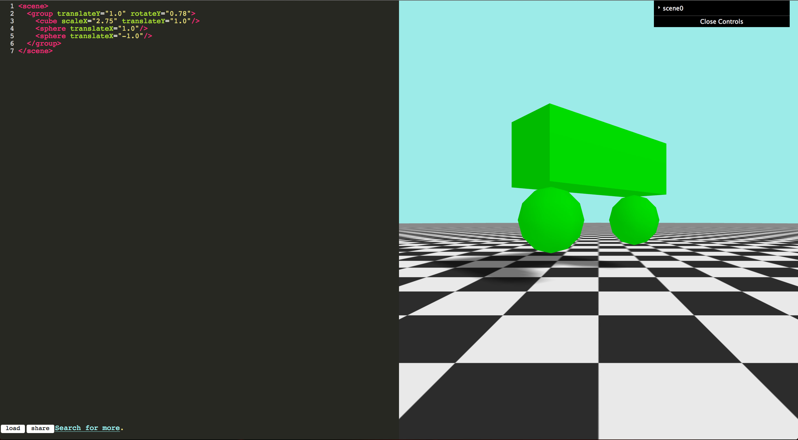

Use the dynamically created controls to modify transforms on individual primitives.  Make sure to add the transform attributes in the code for the controls to be built.  Current arrtibutes supported:

* translateX
* translateY
* translateZ
* rotateX
* rotateY
* rotateZ
* scaleX
* scaleY
* scaleZ

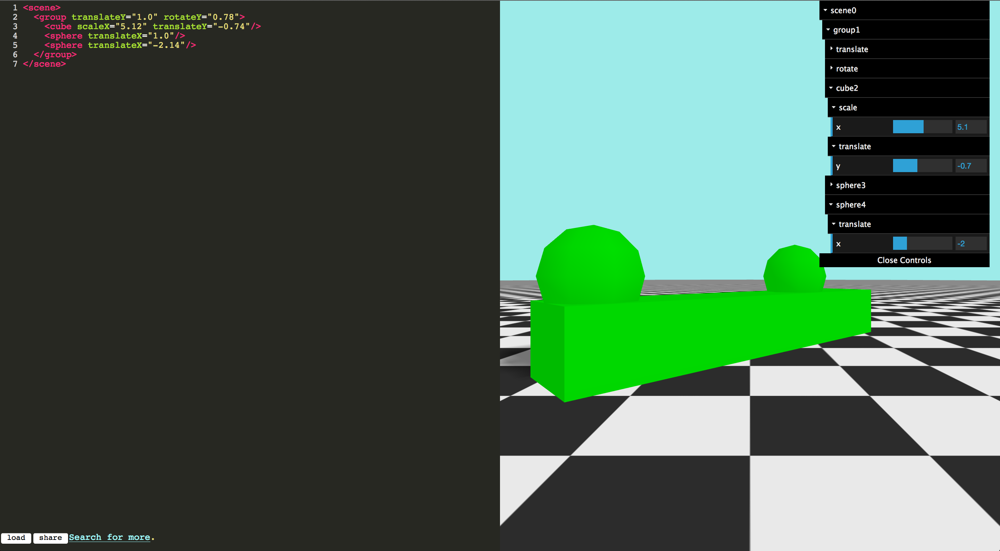

or edit transforms on groups to have the transforms applied to all children in the hierarchy.
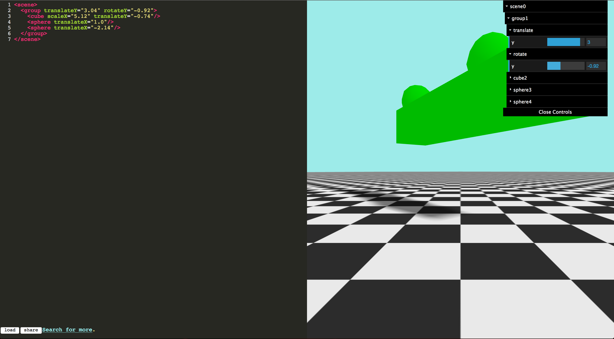

Add new primitives to the scene, and the controls will be dynamically added for listed attributes.
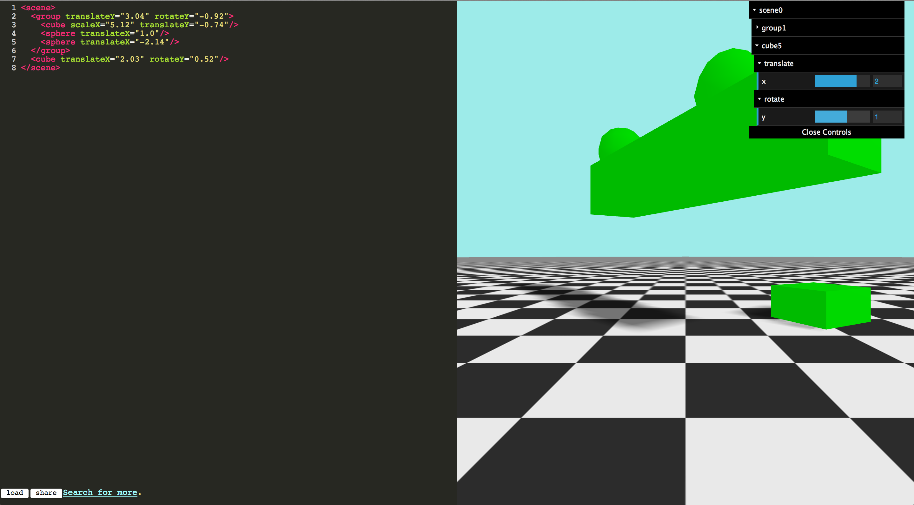

Place them in groups to combine transforms (ie. rotateY, then translateX, then rotateY again).
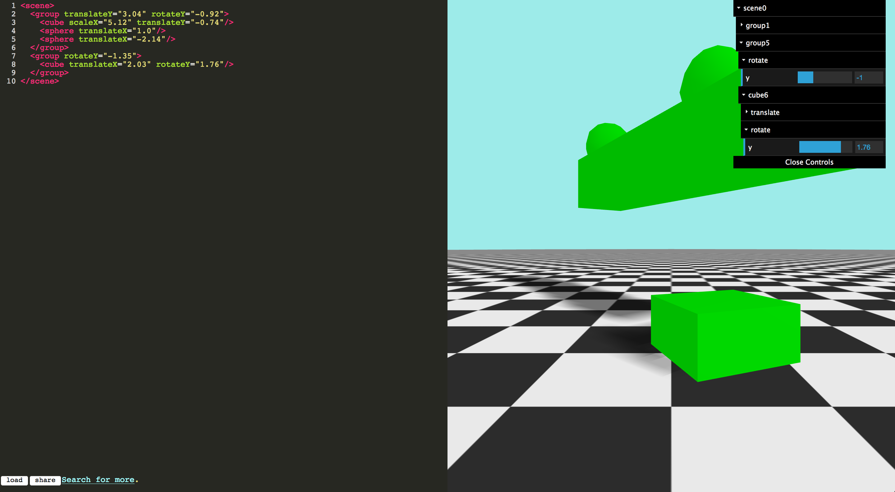

##Share
Click share to publish an anonymous gist to Github.  Github's API is limited to 60 anonymous gists created per hour per IP address.
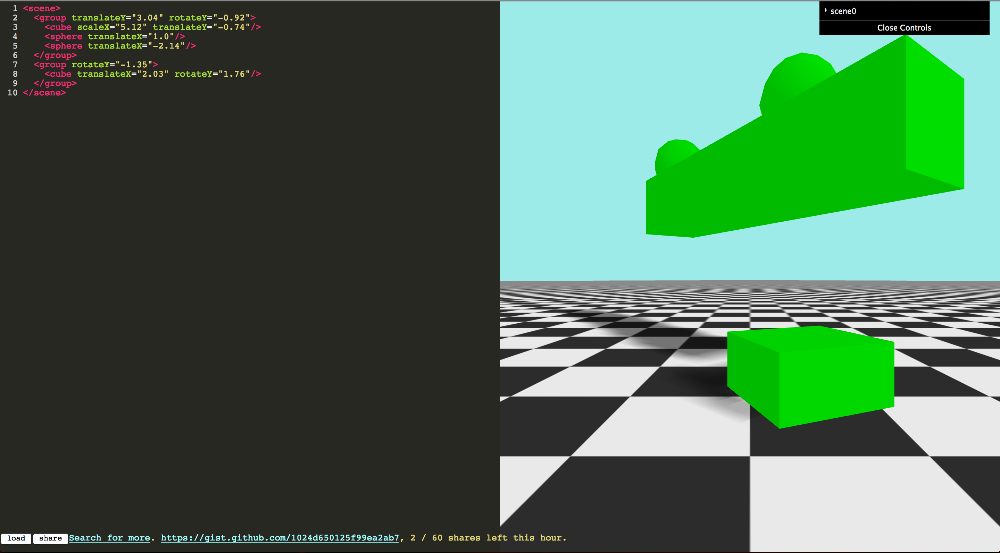

Click the created link to view your gist.
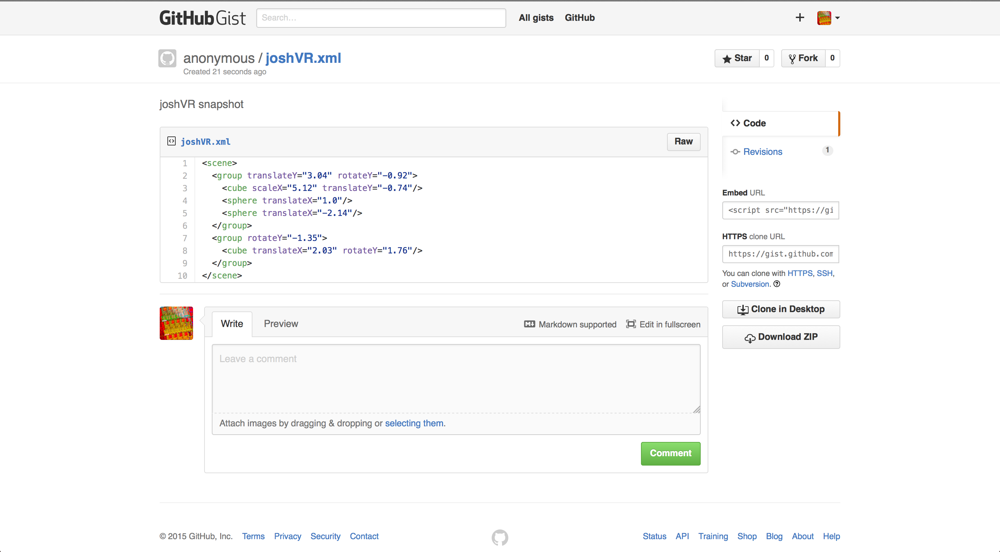

Click "search for more" to see other demos others have created.
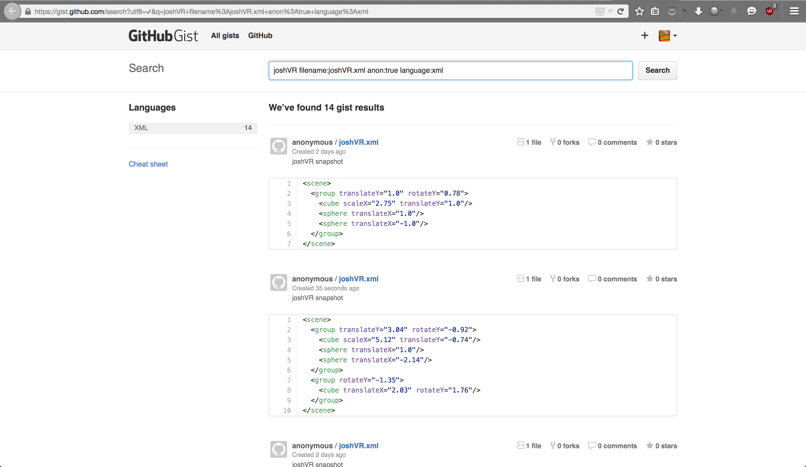

Click "load" to load another scene created from a friend.
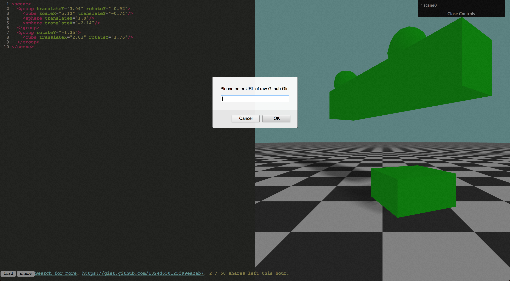

Enter the URL of the RAW gist.  Make sure it's the **RAW** link from Github!  When viewing another gist, click the raw button in the top right of the source.

Click OK to have your currently scene replaced witht he contents of the gist.  The scene and its controls will be rebuilt.
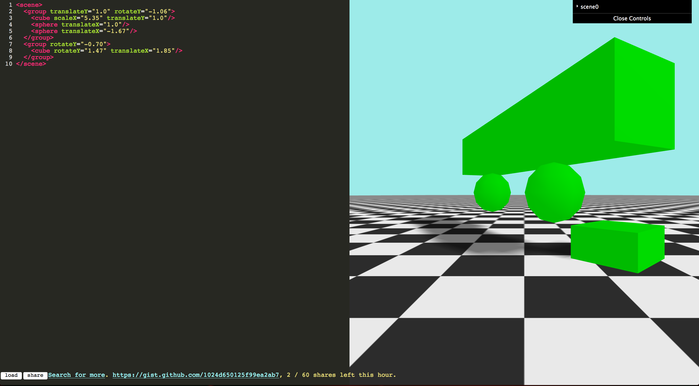

##Experience
Click on the canvas to enter fullscreen+pointerlock.  Plug in a VR headset, fire up Firefox, and grab the [VR addon](http://mozvr.com/downloads/).
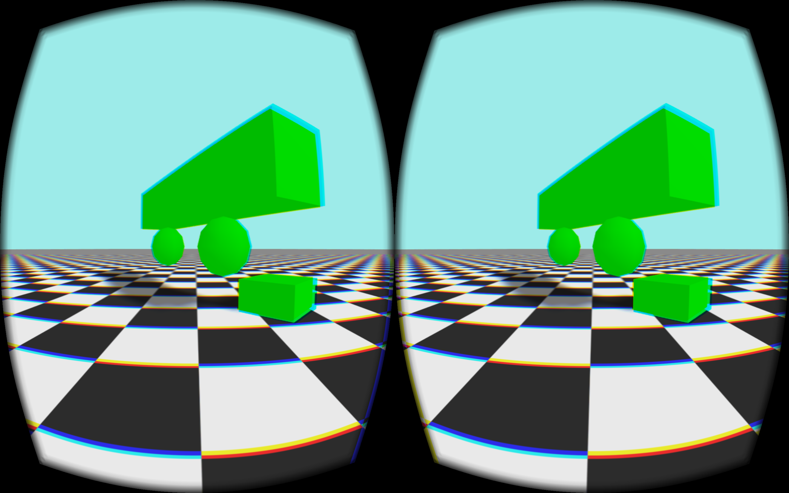

Move yor head around, turn from side to side, roll, look up and down, and move around within the front facing position sensor's frustum.  Click this screenshot for video!

[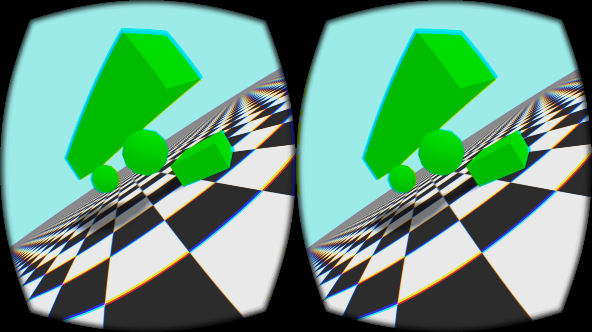](https://vimeo.com/136548758)
